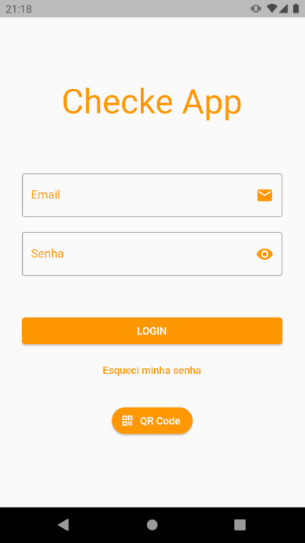
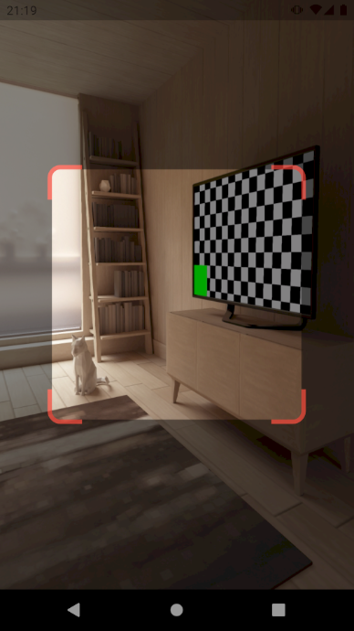
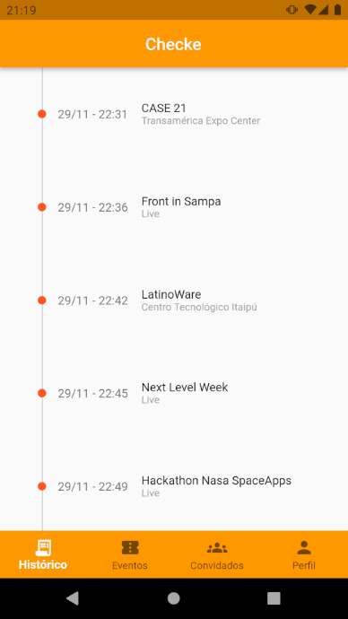
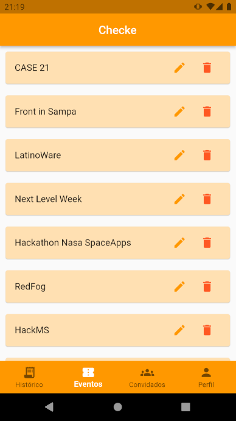

# Checke App

Um app (em desenvolvimento) para criação e controle de acesso de convidados em eventos.

Crie, edite, adicione pessoas na lista do evento e compartilhe com seus convidados 
o QR Code de permissão de acesso.

## Imagens

  
  

  
  

## Play Store

Confira meus apps publicados na  

Disponível em breve na loja.

## Tecnologias utilizadas

    
    
    
    

Obrigado!
